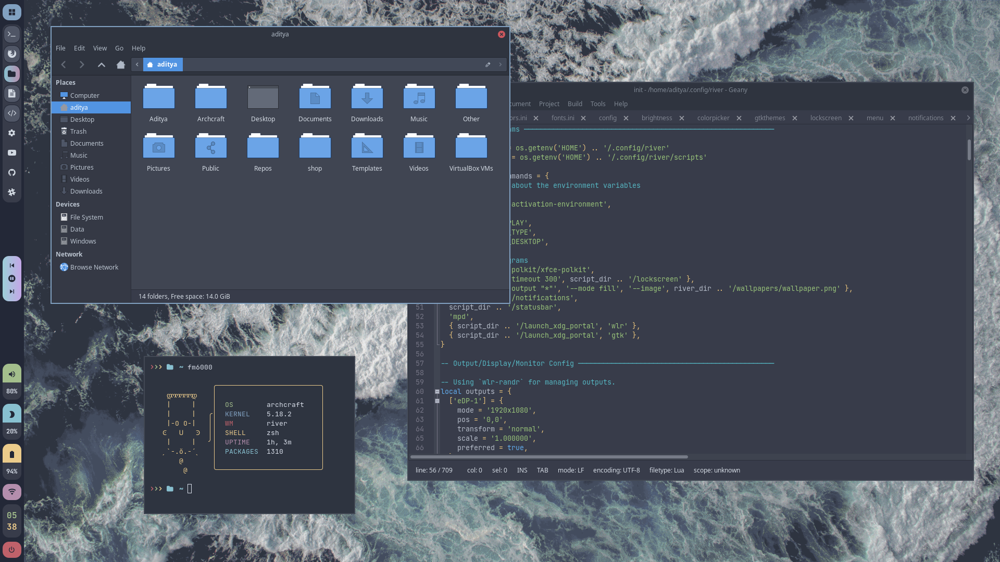
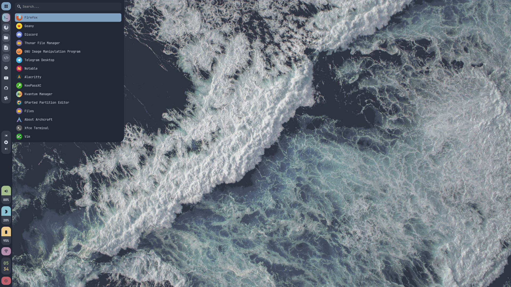
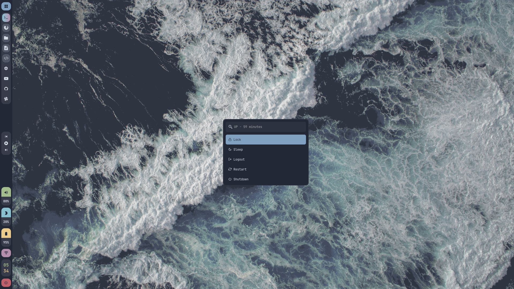
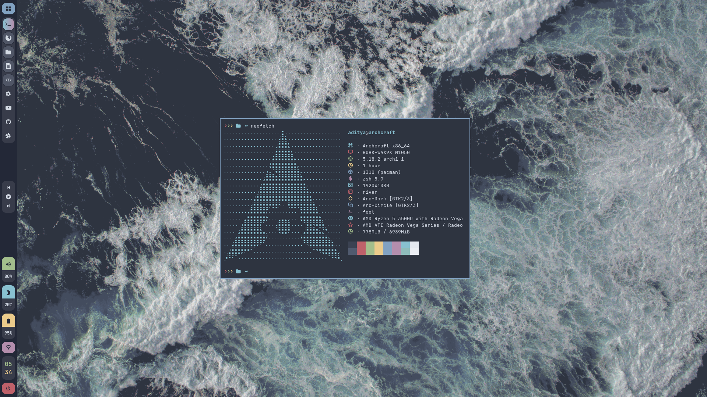
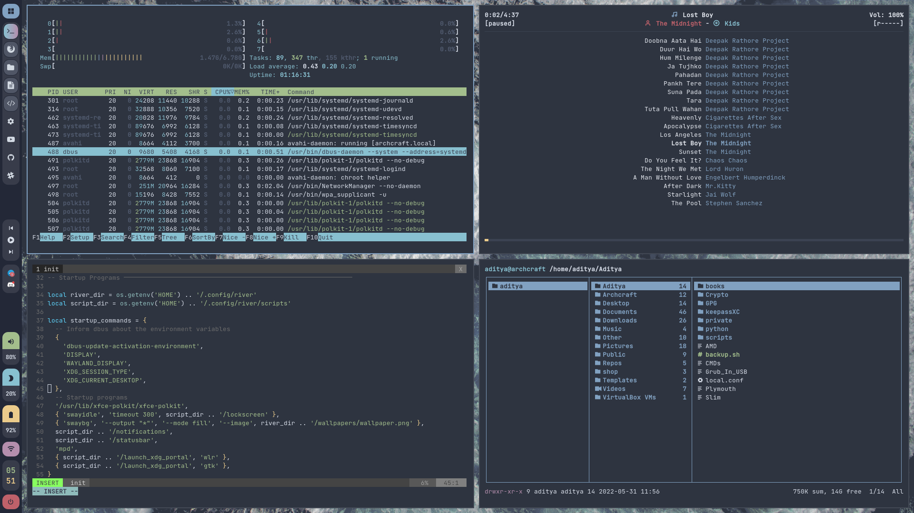
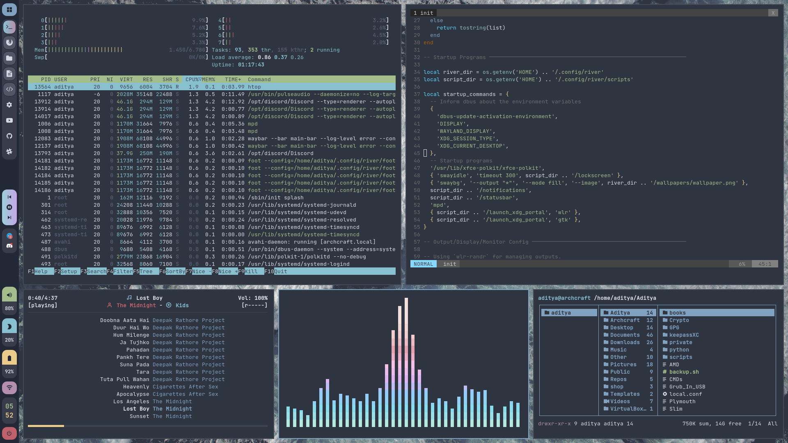
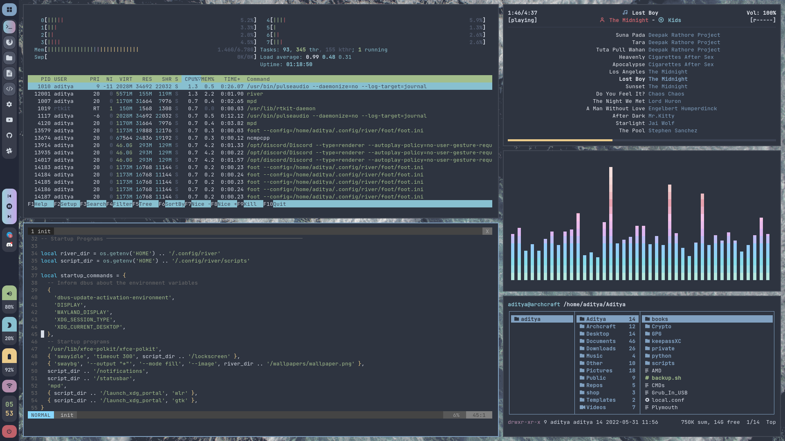
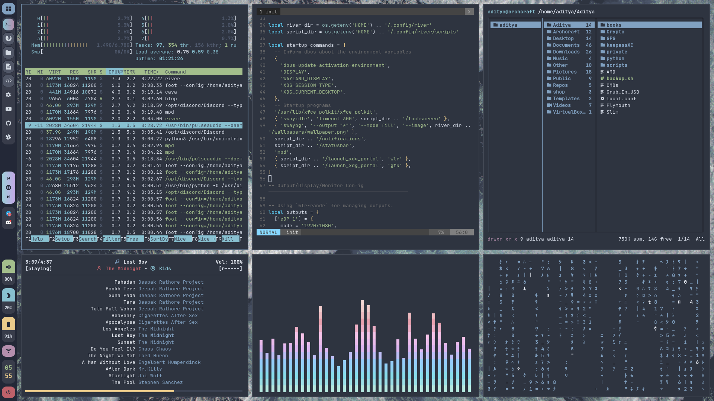

<h1 align="center">RIVER</h1>

[](https://youtu.be/MwnK6arB2Rc)

<p align="center">The ultimate River configuration (A Desktop Environment Like Experience)</p>

---

## Overview

[River](https://github.com/riverwm/river) is a dynamic tiling Wayland compositor with flexible runtime configuration.

- **Operating System** : `Archcraft`
- **Window Manager** : `River`
- **Status Bar** : `Waybar`
- **Launcher** : `Wofi`
- **Session Manager** : `Wofi Applet`
- **Notifications** : `Mako`
- **Terminal** : `Foot`
- **File Manager** : `Thunar`
- **Text Editor** : `Geany`
- **Web Browser** : `Firefox`

## Installation
- **Get the files from** : [Ko-fi :coffee:](https://ko-fi.com/s/69957c0587)
- Extract The file **river.tar.gz** with : `tar -xzvf river.tar.gz`
- If you are using **`Archcraft`** as your OS, You can just install the provided package with : `sudo pacman -U archcraft-river-1.0-1-any.pkg.tar.zst`
- If you want to install this setup on _Arch Linux_ or on any _other distro_, follow the points below :
  - Install the following programs on your computer: `river` `lua` `lua-posix` `wlr-randr` `swaybg` `swayidle` `swaylock` `wlroots` `wl-clipboard` `waybar` `wofi` `foot` `mako` `grim` `slurp` `wf-recorder` `light` `yad` `thunar` `geany` `mpv` `mpd` `mpc` `viewnior` `imagemagick` `xfce-polkit` `xorg-xwayland`
  - After installing programs above, Create river directory in **`~/.config`** : `mkdir -p ~/.config/river`
  - Copy Everything from _dotfiles_ to **`~/.config/river`** : `cp -r ./dotfiles/* ~/.config/river/` 
  - Logout and login to your amazingly configured River WM.

### Appearance

Install the following `theme`, `icon pack`, `cursors` and `fonts` for overall appearance.

- GTK Theme : [Arc-Dark gtk theme](https://github.com/horst3180/arc-theme)
- Icon Theme : [Arc icon theme](https://github.com/horst3180/arc-icon-theme)
- Cursor Theme : [Qogir cursor theme](https://www.gnome-look.org/p/1366182/)
- Fonts : [JetBrainsMono Nerd Font](https://github.com/ryanoasis/nerd-fonts/releases/download/v2.1.0/JetBrainsMono.zip), [Iosevka Nerd Font](https://github.com/ryanoasis/nerd-fonts/releases/download/v2.1.0/Iosevka.zip), [Icomoon Feather](https://github.com/archcraft-os/archcraft-packages/blob/main/archcraft-fonts/files/icon-fonts/Icomoon-Feather.ttf), [Archcraft](https://github.com/archcraft-os/archcraft-packages/blob/main/archcraft-fonts/files/icon-fonts/archcraft.ttf)

## Config Structure
```
~/.config
└── river             : River config directory
    ├── foot          : Terminal config
    ├── mako          : Notification daemon config
    │   └── icons     : Notification icons
    ├── scripts       : Various scripts for functionality
    ├── wallpapers    : Wallpapers
    ├── waybar        : Statusbar config
    ├── wofi          : Launcher, Powermenu config
    └── init          : River init file (main config)
```

## Keybindings

| Keys | Action |
| --- | --- |
| <kbd>super + Return</kbd> | Open terminal |
| <kbd>super + shift + Return</kbd> | Open floating terminal |
| <kbd>super + alt + Return</kbd> | Open terminal with selected geometry |
| <kbd>super + shift + F</kbd> | Open file manager |
| <kbd>super + shift + E</kbd> | Open text editor |
| <kbd>super + shift + W</kbd> | Open web browser|
| <kbd>super + D</kbd> | Run app launcher |
| <kbd>super + X</kbd> | Run powermenu |
| <kbd>super + N</kbd> | Open network manager |
| <kbd>super + P</kbd> | Run colorpicker |
| <kbd>super + C/Q</kbd> | Kill active window |
| <kbd>ctrl + alt + L</kbd> | Run lockscreen |
| <kbd>ctrl + alt + Space</kbd> | Dismiss all notifications |
| <kbd>ctrl + alt + Delete</kbd> | Exit RiverWM instantly |
| <kbd>super + 1,2..9</kbd> | Change workspace/tag from 1 to 9 |
| <kbd>super + shift + 1,2..9</kbd> | Move active container to repective workspace/tag |
| <kbd>super + Left</kbd> | Change focus to the next view |
| <kbd>super + Right</kbd> | Change focus to the previous view |
| <kbd>super + shift + Left</kbd> | Swap focused view with the next view |
| <kbd>super + shift + Right</kbd> | Swap focused view with the previous view |
| <kbd>super + J</kbd> | Change focus to the next output |
| <kbd>super + K</kbd> | Change focus to the previous output |
| <kbd>super + shift + J</kbd> | Send the focused view to next output |
| <kbd>super + shift + K</kbd> | Send the focused view to previous output |
| <kbd>super + E</kbd> | Bump the focused view to the top of the layout stack |
| <kbd>super + F</kbd> | Toggle fullscreen mode |
| <kbd>super + Space</kbd> | Toggle floating mode |
| <kbd>super + H</kbd> | Decrease the main_factor value of rivertile by 0.02 |
| <kbd>super + L</kbd> | Increase the main_factor value of rivertile by 0.02 |
| <kbd>super + shift + H</kbd> | Increment the main_count value of rivertile |
| <kbd>super + shift + L</kbd> | Decrement the main_count value of rivertile |
| <kbd>ctrl + alt + Left</kbd> | change layout orientation to left |
| <kbd>ctrl + alt + Down</kbd> | change layout orientation to down |
| <kbd>ctrl + alt + Up</kbd> | change layout orientation to up |
| <kbd>ctrl + alt + Right</kbd> | change layout orientation to right |
| <kbd>super + alt + Left</kbd> | move views (floating) to left side |
| <kbd>super + alt + Down</kbd> | move views (floating) towards Down |
| <kbd>super + alt + Up</kbd> | move views (floating) towards Up |
| <kbd>super + alt + Right</kbd> | move views (floating) to right side |
| <kbd>super + ctrl + Left</kbd> | resize views (floating) |
| <kbd>super + ctrl + Down</kbd> | resize views (floating) |
| <kbd>super + ctrl + Up</kbd> | resize views (floating) |
| <kbd>super + ctrl + Right</kbd> | resize views (floating) |
| <kbd>super + ctrl + alt + H</kbd> | snap views to screen edges |
| <kbd>super + ctrl + alt + J</kbd> | snap views to screen edges |
| <kbd>super + ctrl + alt + K</kbd> | snap views to screen edges |
| <kbd>super + ctrl + alt + L</kbd> | snap views to screen edges |

## Screenshots

| App Launcher (wofi) | Powermenu (wofi applet) |
| --- | --- |
|||

| Terminal (foot) | Floating Mode (thunar, geany, fetch) |
| --- | --- |
|||

| Tile Layout 1 | Tile Layout 2 |
| --- | --- |
|||

| Tile Layout 3 | Tile Layout 4 |
| --- | --- |
|||


## FYI
- May or may not work on [**`Nvidia`**](https://wiki.archlinux.org/title/Sway#Installation), See [wayland requirements](https://wiki.archlinux.org/title/wayland#Requirements).
- Thank you for your support.

---

### See Also

| [**`archcraft-sway`**](https://github.com/archcraft-os/archcraft-sway) | [**`archcraft-wayfire`**](https://github.com/archcraft-os/archcraft-wayfire) | [**`archcraft-hyprland`**](https://github.com/archcraft-os/archcraft-hyprland) | [**`archcraft-newm`**](https://github.com/archcraft-os/archcraft-newm) |
| --- | --- | --- | --- |
|[](https://github.com/archcraft-os/archcraft-sway)|[](https://github.com/archcraft-os/archcraft-wayfire)|[](https://github.com/archcraft-os/archcraft-hyprland)| [](https://github.com/archcraft-os/archcraft-newm)|
